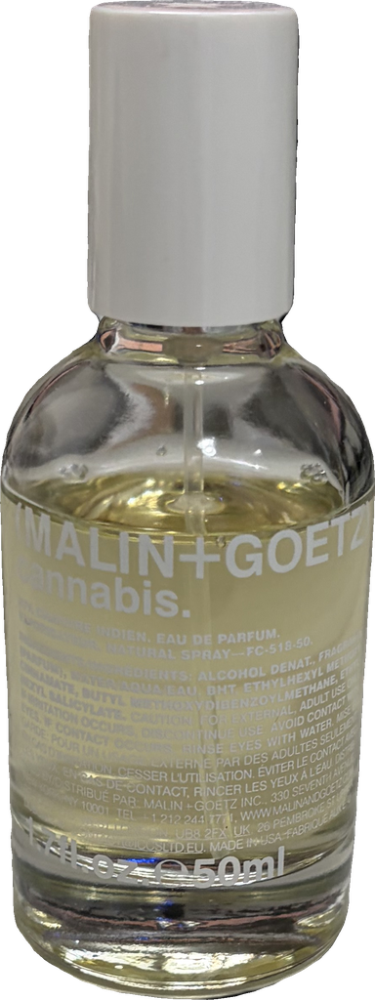
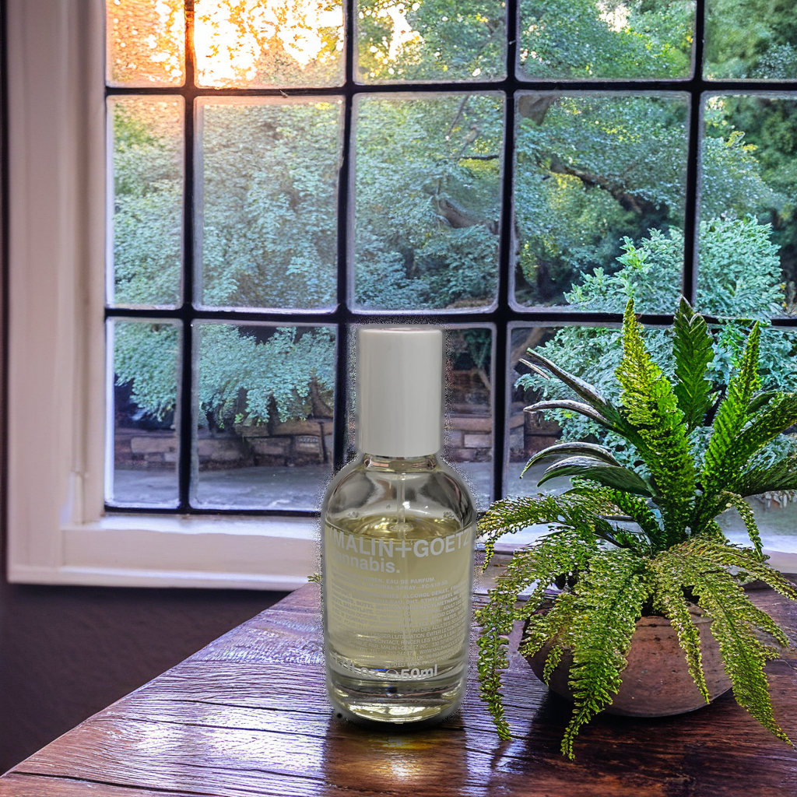
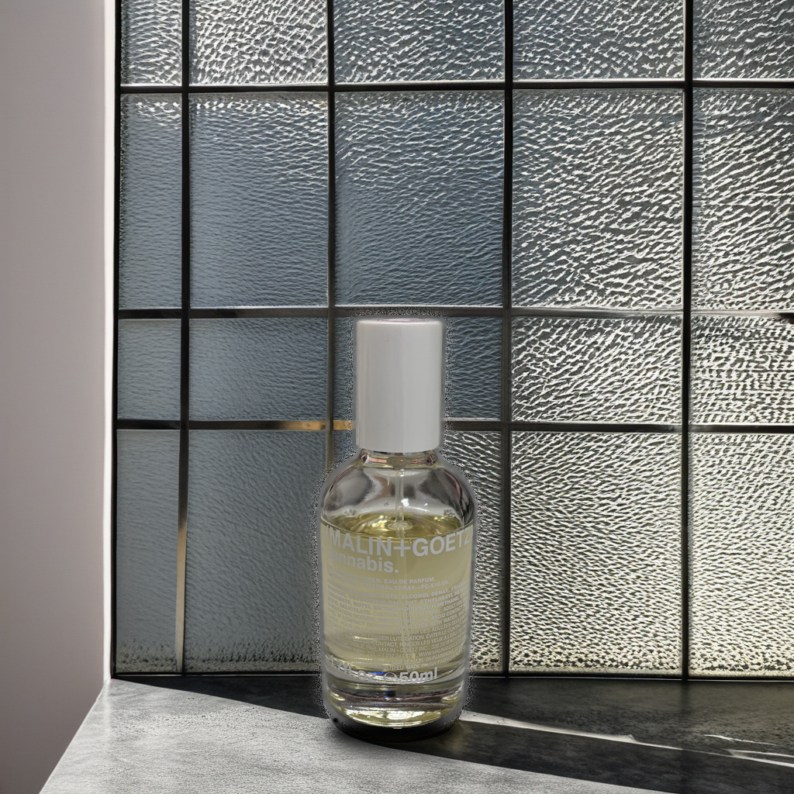
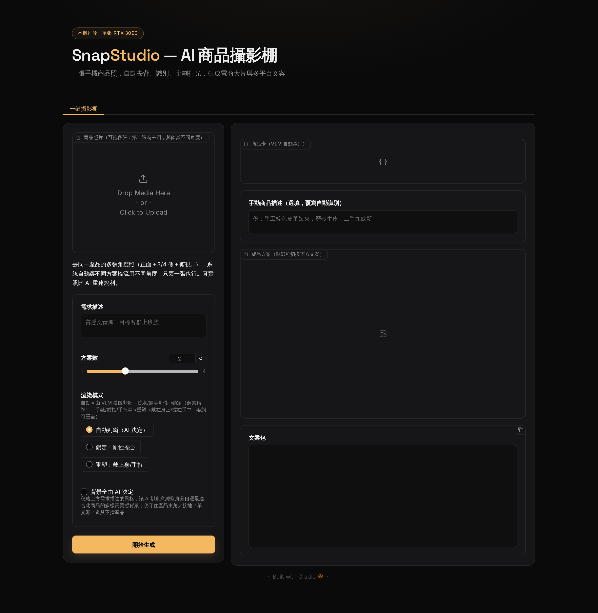
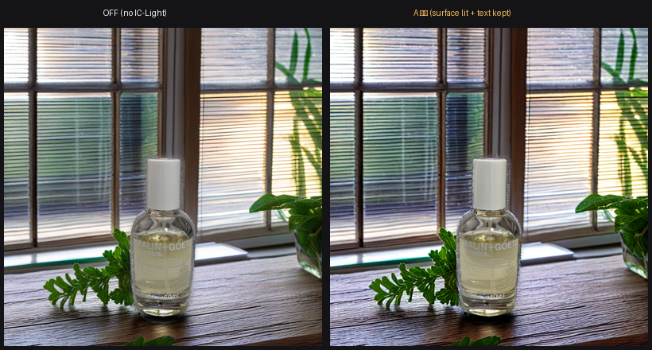

# SnapStudio — AI 商品攝影棚

**一張手機隨手拍的商品照進來，一整套可上架的電商素材出去。** 自動去背 → VLM 識別 → LLM 場景企劃 → Diffusion 生成 → 物理合理的重新打光 → 多平台文案，全程在單張 RTX 3090（24 GB）本機推論。設計核心：**LLM 與 Diffusion 在參數層級互相咬合**，而不是兩條各跑各的流水線。

> 深度生成模型課程期末專題。完整設計見 [docs/ARCHITECTURE.md](docs/ARCHITECTURE.md)，開發歷程見 [DEVLOG.md](DEVLOG.md)。

## 成果展示

同一張隨手拍的香水照，下不同的口語需求，產出風格迥異、產品坐進場景（非貼紙浮貼）的電商大圖：

| 輸入（隨手拍） | 「陽光 花園」 | 「窗邊灑進陽光」 | 「Loft 工業風」 |
|:---:|:---:|:---:|:---:|
|  |  |  |  |

產品永遠是最醒目的主角、站在合理檯面、有程式合成的接地陰影，品牌標籤逐像素清晰。

## 功能

- **一鍵去背**：rembg（BiRefNet）抓 bbox → SAM2 box-refine，輸出 0% 白暈邊的 RGBA 前景
- **VLM 商品識別**：照片 → 結構化商品卡（類別/材質/賣點/受眾），並由 VLM 看圖決定 `product_class`（剛性/穿戴/手持）
- **LLM 場景企劃**：口語需求（「質感文青風」「陽光花園」）→ N 組方案 JSON（場景 prompt、光向、擺位、構圖）
- **AI 自動路由雙模式**：剛性品（香水/罐/瓶）走**鎖定模式**（像素精準擺台）、穿戴/手持品（手錶/戒指/手把）走**重塑模式**（戴上身/握在手中、姿態可重畫）；亦可手動覆寫
- **背景全由 AI 決定**：勾選後忽略風格描述，由 LLM 以創意總監身分自選最適合此商品的多樣高質感背景
- **Inpaint-grounded 場景生成**：鎖住商品像素，用**專用 9 通道 inpaint 權重（優先 RealVisXL V4 inpaint，不存在時自動退用官方 SDXL 1.0 inpaint）**在商品**周圍**生成檯面與場景，接地陰影/反光在同一次去噪自然生成
- **主角擺放控制**：商品大小／水平／垂直／旋轉皆可調，場景隨之重生
- **IC-Light 光線融合（UI 預設開・A 護字）**：讓商品表面吃場景光、更融入，而**文字/logo 與輪廓邊保持原始銳利**（純 CV 偵測標籤區護住，偵測不可靠時自動退回、永不糊字）。Gradio UI 固定開啟（`harmonize=True`）；CLI／直接呼叫 `pipeline.process()` 預設關，需顯式傳 `harmonize=True`
- **電商文案**：蝦皮標題（含關鍵字）、五點賣點、IG 貼文 + hashtags
- **多輪修改**：「光再暖一點、背景換大理石」→ LLM 解析為參數差分；移動主角免 LLM（約 3.5 s）
- **Gradio premium UI**：暗色攝影棚風格自訂主題（單一暖琥珀強調色、Space Grotesk + Inter editorial 字體、卡片化版面）

<p align="center"></p>

## 系統架構

編排器 `snapstudio/pipeline.py::SnapStudio.process()` 串起「**LLM 決策 → Diffusion 執行**」一條鏈，並全程做單卡 VRAM 調度：

```
 使用者照片 ─→ ① 去背 matting.py（rembg bbox → SAM2 精修）
                 ↓
              ② VLM 商品識別 llm.py → 商品卡 JSON（含 product_class）
                 ↓                    ← 此處先卸 VLM 騰 VRAM 給文字模型
              ③ LLM 場景企劃 llm.py（核心咬合點）
                 商品卡 + 口語需求 → N 組方案 JSON
                 { scene_prompt（檯面+背景）, light_direction, 擺位… }
                 ↓                    ← LLM 階段結束卸 Ollama，diffusion 才載入
              ④ AI 路由：剛性 → 鎖定模式 / 穿戴・手持 → 重塑模式
                 ↓
        ┌── 鎖定模式 ──────────────┐   ┌── 重塑模式 ────────────┐
        │ compose.py 主角定位+雜訊底 │   │ reshape.py             │
        │ groundgen.py 9 通道 inpaint │   │ IP-Adapter 把產品身份  │
        │ 在商品周圍生成場景         │   │ 重畫成戴/握姿態        │
        │ → 程式三層接地陰影貼回     │   │ → 真實細節面合成回補   │
        └────────────┬─────────────┘   └───────────┬────────────┘
                     ↓ ⑤ IC-Light 光線融合（A 護字：表面吃光、文字護住）
                     ↓
              ⑥ LLM 文案 llm.py → 蝦皮標題 / 賣點 / IG 貼文
                     ↓
              輸出素材包（Gradio UI 呈現、可調擺放／多輪修改）
```

**LLM↔Diffusion 咬合點**：場景企劃輸出的 `scene_prompt` 直接餵 SDXL inpaint、`light_direction` 餵程式接地陰影與 IC-Light、`worn_framing` 餵重塑取景。所有 LLM 輸出強制 JSON → pydantic 驗證（`schemas.py`）→ 重試 → 失敗套預設模板，**系統永不因 LLM 掛掉而卡死**。

**VRAM 調度（單卡 24 GB 的關鍵）**：VLM（~21 GB）、文字模型（~20 GB）、diffusion（~10-20 GB）任兩個都塞不下，故序列載入、用 `release_models(wait=True)` 卸乾淨再載下一個。識別用完的 VLM 必須先卸才能載文字模型，否則同駐會 OOM。

## 技術亮點

- **Inpaint-grounded 而非「先造背景再貼產品」**：產品像素鎖死、SDXL 9 通道 inpaint 在周圍長場景，接地陰影/反光自然生成 → 產品真正坐進場景。關鍵坑：init 底必須用**高頻雜訊**（純色會把 inpaint 錨成同色）。
- **IC-Light 在 diffusers 0.39 重新實作**：官方碼僅支援 0.27，本專題改寫 UNet conv_in 通道、權重 offset 合併、forward 攔截。再加 **A 護字**：純 CV（HSV 主色面）偵測標籤區，讓產品表面吃場景光、只把文字/logo 還原銳利，三層 fallback 永不糊字。
- **AI 自動路由雙模式**：模式由 VLM 看圖判斷（關鍵字僅離線降級備援），剛性走像素精準鎖定、穿戴/手持走 IP-Adapter 重塑。
- **契約式 LLM 鏈**：端點降級（可選遠端 → 本機 Ollama）→ 強制 JSON → pydantic → 重試 → 模板；含簡體字防線。
- **程式合成接地陰影**：接地靠 `compose.paste_back` 的三層程式陰影（投射+接觸核+ambient occlusion），不靠 prompt，立式產品不浮貼。

## 課程技術對應

| 作業要求 | 本專題的具體實現 |
|---|---|
| LLM：Prompt Engineering | 場景企劃將口語需求展開為 SDXL prompt + 負面詞 + 擺位/光向 |
| LLM：API 整合 / 本機推論 | 文字企劃/文案與 VLM 識別皆走本機 Ollama（qwen3:32b + qwen2.5vl:32b），OpenAI 相容；遠端端點可選、預設關 |
| Diffusion：客製化 Pipeline | IC-Light 重打光在 diffusers 0.39 重新實作（conv_in 4→8/12 通道、權重 offset 合併、forward 攔截） |
| Diffusion：推論加速 | 9 通道 inpaint 1024² 約 6-9 s/張；IC-Light 走 LCM-LoRA 8 步 768²；移動主角重生免 LLM |
| 互動 UI | Gradio 6 自訂 premium 主題 |

## 本地執行

**環境需求**：NVIDIA GPU ≥ 24 GB VRAM（RTX 3090 實測）、Python 3.10、CUDA 12.1 驅動、磁碟約 20 GB（權重 + 環境）。

```bash
# 1. 建立環境
python3.10 -m venv .venv && source .venv/bin/activate
pip install -r requirements.txt

# 2. 下載權重（約 12 GB；wget 斷點續傳，中斷直接重跑）
bash scripts/download_weights.sh

# 3. 本機 LLM：安裝 Ollama 後拉模型
ollama pull qwen3:32b        # 文字：場景企劃 / 文案
ollama pull qwen2.5vl:32b    # 視覺：商品識別（首次執行自動建立限制 context 的 -ctx8k 變體，兼顧速度）

# 4. 啟動（瀏覽器開 http://localhost:7860）
python app.py

# CLI 一鍵素材包
PYTHONPATH=. python cli.py --image  --brief "文青風" --n 3
```

注意事項：

- rembg 去背權重首次執行自動下載（走 GitHub，不經 HF CDN）。
- 模型一律離線載入（`HF_HUB_OFFLINE=1`，於 `snapstudio/config.py` 設定）。RealVisXL 單檔載入需 SDXL 基底設定檔；若本機無 `stabilityai/stable-diffusion-xl-base-1.0` 與 `madebyollin/sdxl-vae-fp16-fix` 的 HF 快取，先以 `HF_HUB_OFFLINE=0` 啟動一次抓設定檔（僅數 MB）。

## LLM 端點設定

所有端點皆為 OpenAI 相容介面，環境變數可覆寫（定義於 `snapstudio/config.py`）：

| 環境變數 | 預設值 | 說明 |
|---|---|---|
| `SNAPSTUDIO_OLLAMA_TEXT_MODEL` | `qwen3:32b` | 本機文字模型（場景企劃/文案，文字主力） |
| `SNAPSTUDIO_OLLAMA_VISION_MODEL` | `qwen2.5vl:32b-ctx8k` | 本機視覺模型（商品識別） |
| `SNAPSTUDIO_OLLAMA_BASE_URL` | `http://localhost:11434/v1` | 本機 Ollama 端點 |
| `SNAPSTUDIO_USE_REMOTE_LLM` | `0`（關） | 是否啟用遠端文字端點；預設只用本機（遠端推理模型偶爾不穩/回空，故預設關） |
| `SNAPSTUDIO_LLM_BASE_URL` | `https://opencode.ai/zen/v1` | 遠端文字端點（僅 `USE_REMOTE_LLM=1` 時用） |
| `SNAPSTUDIO_LLM_MODEL` | `opencode/big-pickle` | 遠端文字模型名 |
| `SNAPSTUDIO_LLM_API_KEY` | 空（退讀 `OPENCODE_API_KEY`） | 遠端金鑰 |

想換更快但較弱的文字模型，或啟用遠端：

```bash
export SNAPSTUDIO_OLLAMA_TEXT_MODEL=qwen3:14b   # 更快、規則服從度較差
export SNAPSTUDIO_USE_REMOTE_LLM=1              # 啟用遠端端點（預設關）
python app.py
```

## 效能（RTX 3090 實測）

| 階段 | 設定 | 速度 | VRAM 峰值 |
|---|---|---|---|
| Inpaint-grounded 生成 | 1024²、32 步、GS 7.5 | 約 6-9 s/張 | ~10 GB |
| IC-Light 光線融合（A 護字） | 768²、LCM 8 步 | 約 +2 s/張 | ~3.6 GB |
| 移動主角重生（免 LLM） | 同上 | 約 3.5 s/張 | — |

> 瓶頸是本機 LLM 推論：文字主力 qwen3:32b 比 14b 更聽話但約慢一倍（場景企劃數十秒）；VLM 識別與品質把關各載入一次 VLM、冷啟動較久。填寫「手動商品描述」可跳過識別那次 VLM 載入、縮短首次生成時間。

## IC-Light A 護字（before / after）

開啟後產品表面吃到場景光、更融入，文字/logo 仍維持原始銳利：

<p align="center"></p>

## 專案結構

```
HW7_snapstudio/
├── app.py                   # Gradio UI 入口（自訂 premium 主題）
├── cli.py                   # 命令列一鍵：照片 → 素材包
├── requirements.txt
├── snapstudio/
│   ├── config.py            # 路徑 / 模型 / LLM 端點全域設定
│   ├── schemas.py           # LLM JSON 契約的 pydantic 模型（商品卡/方案/文案）
│   ├── matting.py           # 去背（rembg / BiRefNet → SAM2 精修）
│   ├── llm.py               # VLM 識別 / 場景企劃 / 文案 / 修改解析
│   ├── compose.py           # 主角定位 + 雜訊底 + 遮罩 + 貼回 + A 護字
│   ├── groundgen.py         # inpaint-grounded 場景生成（RealVisXL V4 9 通道 inpaint）
│   ├── reshape.py           # 重塑模式（RealVisXL V5 text2img + IP-Adapter 戴/握姿態 + 真實細節面合成）
│   ├── relight.py           # IC-Light 光線融合（diffusers 0.39 重實作）
│   ├── pipeline.py          # 編排器與 VRAM 調度
│   └── scene.py             # （v1 舊）整張背景生成，保留供參考
├── scripts/download_weights.sh   # 權重下載（wget -c 斷點續傳 + 大小驗證）
├── weights/                 # 模型權重（gitignore，約 12 GB）
├── examples/                # 範例輸入、展示圖（showcase/）與成品
└── docs/
    ├── ARCHITECTURE.md      # 完整系統架構設計
    ├── WORKFLOW_LOG.md      # Agent 協作紀錄（課程交付物）
    └── exploration/         # 前期技術探索（多視角 3D、推論加速 bench 等）
```
