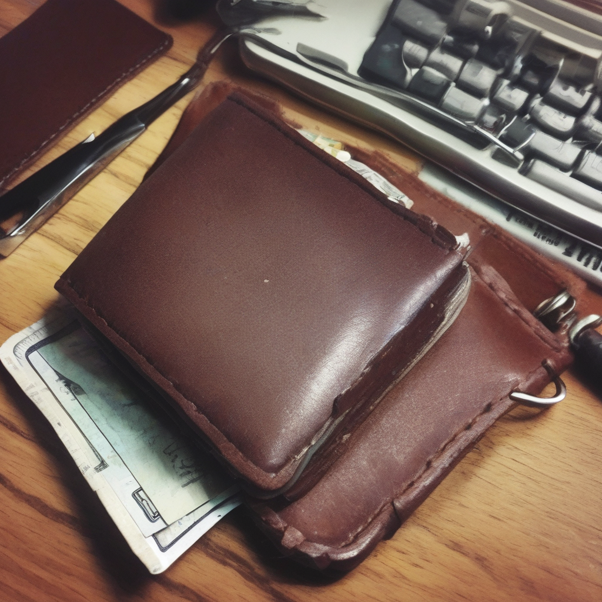

# SnapStudio — AI 商品攝影棚

**一張手機隨手拍的商品照進來，一整套可上架的電商素材出去**：自動去背 → AI 場景生成 → 物理合理的重新打光 → 多平台文案，全程本機推論（單張 RTX 3090），LLM 與 Diffusion 在參數層級互相咬合，而不是兩條各跑各的流水線。

> 深度生成模型課程期末專題。完整設計文件見 [docs/ARCHITECTURE.md](docs/ARCHITECTURE.md)。

## 成果展示

| 輸入（隨手拍） | 去背前景 | 暖窗光・咖啡館 | 黑色壓克力・輪廓光 |
|:---:|:---:|:---:|:---:|
|  |  |  |  |

同一顆皮夾，光向、色溫、環境反射由 IC-Light 重新計算 — 皮革紋理與縫線完整保留（768×768、25 步、3.1 秒/張）。

## 功能

- **一鍵去背**：rembg（BiRefNet，u2net 備援），輸出 RGBA 前景
- **VLM 商品識別**：照片 → 結構化商品卡（材質/賣點/受眾）
- **LLM 場景企劃**：口語需求（「質感路線、文青風」）→ N 組方案 JSON：場景 prompt、光源方向、氛圍、構圖建議
- **Inpaint-grounded 場景生成**：鎖住商品像素，用 **RealVisXL V4 的 9 通道 inpaint 權重**（`OzzyGT/RealVisXL_V4.0_inpainting`，美感優於官方 SDXL inpaint）在商品**周圍**生成檯面與場景，接地陰影與反光在同一次去噪自然生成——商品真正坐進場景而非貼紙浮貼
- **主角擺放控制**：商品的大小／水平／垂直／旋轉皆可調，場景隨之重新生成
- **AI 自動路由雙模式**：VLM 看圖判斷 — 香水/罐/瓶等剛性品走**鎖定模式**（像素精準擺台）、手錶/戒指/手把等走**重塑模式**（戴上身/握在手中，姿態可重畫）；亦可手動覆寫
- **背景全由 AI 決定**：勾選後忽略風格描述，由 LLM 以創意總監身分自選最適合此商品的多樣高質感背景（仍守產品主角／接地／單光源／道具不擋產品）
- **IC-Light 光線融合（預設開・A 護字）**：讓商品表面吃場景光、更融入場景，而**文字/logo 與輪廓邊保持原始銳利**（純 CV 偵測標籤區護住，偵測不可靠時自動退回、永不糊字）；**官方碼僅支援 diffusers 0.27，本專題在 0.39 重新實作**（UNet conv_in 改通道、權重 offset 合併、forward 攔截）
- **雙檔位推論**：快速（inpaint 12 步，約 4 s/張）vs 精緻（20 步 + 光線融合）
- **電商文案**：蝦皮標題（含關鍵字）、五點賣點、IG 貼文 + hashtags
- **多輪修改**：「光再暖一點、背景換大理石」→ LLM 解析為參數差分；移動主角免 LLM（約 3.5 s）
- **Gradio premium UI**：暗色攝影棚風格自訂主題（單一暖琥珀強調色、Space Grotesk + Inter editorial 字體、卡片化版面）；上傳 → 方案選擇 → 成品 → 文案 + 主角微調，全流程互動

## 系統架構

```
 使用者照片 ──┬─→ ① 去背 matting.py（rembg）────────────────┐
              └─→ ② VLM 商品識別 llm.py → 商品卡 JSON        │
                        ↓                                    │
              ③ LLM 場景企劃 llm.py（核心咬合點）             │
                 商品卡 + 口語需求 → N 組方案 JSON            │
                 { scene_prompt（檯面+背景）, light_desc... } │
                        ↓                                    ↓
              ④ 主角定位＋雜訊底 compose.py（Placement 可調擺放）
                        ↓
              ⑤ Inpaint-grounded 生成 groundgen.py（核心咬合點）
                 SDXL 9 通道 inpaint 在商品周圍生成場景
                 → 接地陰影/反光自然生成 → 商品像素原樣貼回
                        ↓
              ⑥ IC-Light 光線融合 relight.py（預設開・光向 ← 方案 JSON）
                 產品表面吃場景光，文字/logo 區純 CV 偵測後護住保持銳利
                        ↓
              ⑦ LLM 文案生成 llm.py → 蝦皮標題 / 賣點 / IG 貼文
                        ↓
              輸出素材包（Gradio UI 呈現、可調擺放／多輪修改）
```

LLM 與 Diffusion 的咬合點：場景企劃輸出的 `scene_prompt` 直接餵 SDXL inpaint（⑤）、`light_direction`/`light_desc` 直接餵 IC-Light 光線融合條件（⑥）；所有 LLM 輸出強制 JSON → pydantic 驗證 → 重試 → 預設模板，系統永不因 LLM 掛掉而卡死。

## 課程技術對應

| 作業要求 | 本專題的具體實現 |
|---|---|
| LLM：Prompt Engineering | 場景企劃將口語需求展開為 SDXL prompt + 負面詞 |
| LLM：API 整合 / 本機推論 | 文字企劃/文案與 VLM 商品識別皆走**本機 Ollama**（qwen3:32b + qwen2.5vl:32b），OpenAI 相容介面；遠端端點（Big Pickle）可選、預設關 |
| Diffusion：客製化 Pipeline | IC-Light 重打光管線在 diffusers 0.39 重新實作（UNet conv_in 4→8/12 通道、權重 offset 合併、forward 攔截） |
| Diffusion：推論加速 | LCM-LoRA 掛載（25 步 → 4-8 步），快速預覽 vs 精修輸出雙檔位 |
| 互動 UI | Gradio 6 多分頁介面 |

## 本地執行

**環境需求**：NVIDIA GPU ≥ 24 GB VRAM（RTX 3090 實測）、Python 3.10、CUDA 12.1 驅動、磁碟空間約 20 GB（權重 12.7 GB + Python 環境）。

```bash
# 1. 建立環境
python3.10 -m venv .venv
source .venv/bin/activate
pip install -r requirements.txt

# 2. 下載權重（約 12 GB；wget 斷點續傳，中斷直接重跑即可）
bash scripts/download_weights.sh

# 3.（選用）本機 LLM：安裝 Ollama 後拉模型
ollama pull qwen3:32b        # 文字：場景企劃 / 文案
ollama pull qwen2.5vl:32b    # 視覺：商品識別（首次執行自動建立限制 context 的 -ctx8k 變體，兼顧速度與品質）

# 4. 啟動
python app.py                # 瀏覽器開 http://localhost:7860
```

注意事項：

- rembg 的去背權重在首次執行時自動下載（走 GitHub，不經 HF CDN）。
- 模型載入一律離線（`HF_HUB_OFFLINE=1`，已在 `snapstudio/config.py` 設定）；RealVisXL 單檔載入需要 SDXL 基底設定檔，若本機沒有 `stabilityai/stable-diffusion-xl-base-1.0` 與 `madebyollin/sdxl-vae-fp16-fix` 的 HF 快取，先以 `HF_HUB_OFFLINE=0` 啟動一次讓它抓設定檔（僅數 MB）。

## LLM 端點設定

所有端點皆為 OpenAI 相容介面，環境變數可覆寫（定義於 `snapstudio/config.py`）：

| 環境變數 | 預設值 | 說明 |
|---|---|---|
| `SNAPSTUDIO_USE_REMOTE_LLM` | `0`（關） | 是否啟用遠端文字端點；預設只用本機 Ollama（遠端推理模型偶爾不穩/回空，故預設關） |
| `SNAPSTUDIO_LLM_BASE_URL` | `https://opencode.ai/zen/v1` | 遠端文字 LLM 端點（僅 `USE_REMOTE_LLM=1` 時用） |
| `SNAPSTUDIO_LLM_MODEL` | `opencode/big-pickle` | 遠端文字 LLM 模型名 |
| `SNAPSTUDIO_LLM_API_KEY` | 空（退而讀 `OPENCODE_API_KEY`） | 遠端文字 LLM 金鑰 |
| `SNAPSTUDIO_OLLAMA_BASE_URL` | `http://localhost:11434/v1` | 本機 Ollama 端點 |
| `SNAPSTUDIO_OLLAMA_TEXT_MODEL` | `qwen3:32b` | Ollama 文字模型（場景企劃/文案，文字主力） |
| `SNAPSTUDIO_OLLAMA_VISION_MODEL` | `qwen2.5vl:32b-ctx8k` | Ollama 視覺模型（商品識別） |

預設已全走本機 Ollama。範例 — 想換更快的文字模型，或啟用遠端端點：

```bash
export SNAPSTUDIO_OLLAMA_TEXT_MODEL=qwen3:14b   # 想更快可換回 14b（較弱、規則服從度較差）
export SNAPSTUDIO_USE_REMOTE_LLM=1              # 啟用遠端 Big Pickle（預設關）
python app.py
```

## 效能（RTX 3090 實測）

| 階段 | 設定 | 速度 | VRAM 峰值 |
|---|---|---|---|
| Inpaint-grounded 生成（精緻） | 1024²、20 步 | 約 6 s/張 | 9.9 GB |
| Inpaint-grounded 生成（快速） | 1024²、12 步 | 約 3.5 s/張 | 9.9 GB |
| IC-Light 光線融合（預設開・A 護字） | 768²、LCM 8 步 | 約 1.5-2 s/張 | 3.6 GB |
| 移動主角重生（免 LLM） | 同上 | 約 3.5 s/張 | — |

> 註：圖像生成已優化至單張約 4-8 s；流程總時間的瓶頸是本機 LLM 推論
> （文字主力 qwen3:32b 比 14b 更聽話但約慢一倍，場景企劃數十秒；VLM 商品識別冷啟動較久，
> 且識別與品質把關各載入一次 VLM）。填寫「手動商品描述」可跳過 VLM 識別、縮短首次生成時間。

## 專案結構

```
HW7_snapstudio/
├── app.py                   # Gradio UI 入口
├── cli.py                   # 命令列一鍵：照片 → 素材包（輸出 examples/demo_run/）
├── requirements.txt
├── snapstudio/
│   ├── config.py            # 路徑 / 模型 / LLM 端點全域設定
│   ├── schemas.py           # LLM JSON 契約的 pydantic 模型（商品卡/方案/文案）
│   ├── matting.py           # 去背（rembg / BiRefNet）
│   ├── compose.py           # 主角定位 + 雜訊底 + 遮罩 + 貼回（inpaint 前處理）
│   ├── groundgen.py         # inpaint-grounded 場景生成（RealVisXL V4 9 通道 inpaint）
│   ├── relight.py           # IC-Light 光線融合（選配，diffusers 0.39 重實作）
│   ├── scene.py             # （v1 舊）RealVisXL 整張背景生成，保留供參考
│   ├── llm.py               # VLM 識別 / 場景企劃 / 文案 / 修改解析
│   └── pipeline.py          # 編排器（v2 inpaint-grounded）與 VRAM 調度
├── scripts/
│   └── download_weights.sh  # 權重下載（wget -c 斷點續傳 + 大小驗證）
├── weights/                 # 模型權重（gitignore，約 12 GB）
├── examples/                # 範例輸入與成品圖
├── poc/                     # IC-Light 改寫 POC（已驗證可獨立執行）
└── docs/
    ├── ARCHITECTURE.md      # 完整系統架構設計
    ├── WORKFLOW_LOG.md      # Agent 協作紀錄（課程交付物）
    └── exploration/         # 前期技術探索（推論加速 bench 等）
```
